<div align="center">
  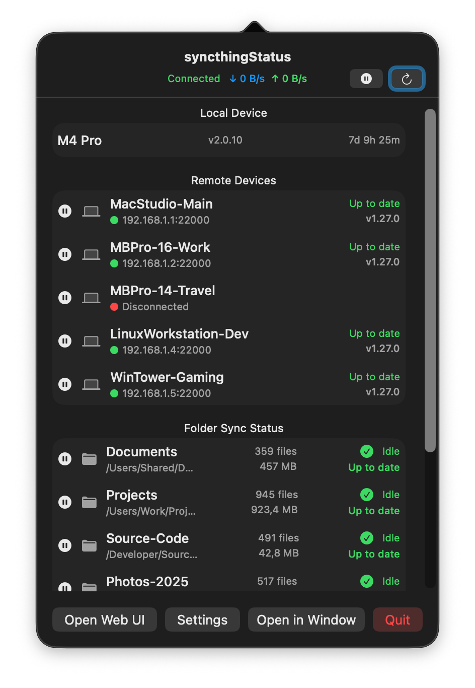
  <h1>syncthingStatus</h1>
  <p>A lightweight macOS menu bar app for monitoring <a href="https://syncthing.net">Syncthing</a> status in real-time.</p>

  
  
  
  
  [](https://github.com/Xpycode/syncthingStatus/releases/latest)
  
</div>

> ⚠️ **v1.5 users**: Auto-update will not work due to a signing key change in v1.5.1. Please [download v1.6.0 manually](https://github.com/Xpycode/syncthingStatus/releases/download/v1.6.0/syncthingStatus-v1.6.0.dmg) once. Future updates will auto-update normally.

## What's New in Version 1.6.0

### New Features
- **Stuck-deletion detection & cleanup** — Syncthing can get wedged when it can't finish deleting a file: the folder shows "Out of sync" indefinitely with pending deletions that never clear. syncthingStatus now detects this specific condition, flags it with an amber alert row in the popover, and gives you a dedicated **cleanup window** that lists every stuck item, lets you **Reveal** each one in Finder, and — once you grant folder access — safely removes the leftovers and triggers a rescan so the folder goes green again.
- **Sandbox-safe folder access** — the cleanup flow requests access to only the affected folder through the standard macOS open panel and remembers it with a security-scoped bookmark. No Full Disk Access required; the app stays sandboxed.
- **Inline Rescan button** — the "Out of sync" folder row now has a one-click rescan button (with tooltip) right where you need it, instead of digging through the context menu.
- **Diagnostic export** — one-click export of the app's recent logs from Settings, for when you want to file a bug or see what the app has been doing. Sandbox-clean; nothing is written to disk during normal use.
- **Versions at a glance** — the popover's Local Device row now shows both the app version and the running Syncthing version, and the About panel reports the connected Syncthing version.

### Bug Fixes
- **No more false "Disconnected" flash** — refreshing while another refresh was already in flight (e.g. right after changing a setting) could briefly flip the menu bar icon to red. A superseded refresh is now ignored instead of being reported as a disconnection.
- **Reliable on non-English systems** — internal cancellation checks no longer depend on matching English error text, so transient errors no longer leak to the UI on localized macOS installs.
- **Launch at Login actually works** — the Settings toggle had never registered the app with macOS (it was using the wrong system API since an old bundle-ID change). Flipping it on now really adds syncthingStatus to System Settings → General → Login Items.
- **Pause/Resume no longer fails silently** — if pausing or resuming a device or folder doesn't reach Syncthing (busy daemon, connection hiccup), the app now shows the error instead of leaving you guessing.

### Internal
- All production logging goes through OSLog (subsystem `com.lucesumbrarum.syncthingStatus`; categories `FolderStatus`, `StuckDeletes`, `FolderAccess`), which is exactly what the diagnostic export captures — no stray `print()` in release paths.
- Destructive cleanup is guarded by strict path validation (rejects `..`, absolute paths, and symlink escapes) plus an explicit confirmation step.

## What's New in Version 1.5.5

### Bug Fixes
- **False "Out of sync" indicator fixed** — the menu bar icon used to latch to red when Syncthing was actually fine, especially after routine background scans. The status logic now treats `scanning`, `scan-waiting`, `sync-preparing`, `sync-waiting`, and `cleaning` states as healthy, and only reports out-of-sync when there is meaningful pending data.
- **Stale-state hygiene** — cached folder status is cleared on fetch failure so a transient hiccup cannot persist as a stuck red icon. Removed devices and folders no longer leave stale entries behind in memory.

### New Features
- **Brand-new app icon and status bar icons** — fresh visual identity throughout.
- **Status icon style** setting — choose **Monochrome** (classic single icon for in-sync) or **Traffic-Light** (adds an amber warning state for soft conditions like paused devices). Defaults to Monochrome to preserve the existing look.
- **Sync notification cooldown** — throttle "Sync Complete" notifications per folder. Default 5 minutes (range 0–60). Stops the notification spam when a folder churns through many small syncs.

### Internal
- Defensive decoding of Syncthing API responses so future field renames cannot brick the icon.
- Status-fetch failures now log via OSLog (`com.lucesumbrarum.syncthingStatus` / `FolderStatus`) for easier diagnosis in Console.app.

## What's New in Version 1.5.1

### Bug Fixes
- **Fixed Update Detection** - Resolved an issue where the app incorrectly prompted for updates when already on the latest version

## What's New in Version 1.5

### New Features
- **Auto-Updates via Sparkle** - The app can now check for and install updates automatically
- **Update Button** - Quick access to check for updates from the footer or Settings
- **Automatic Update Checking** - Configurable in Settings with toggle to enable/disable

### Bug Fixes
- **Settings Migration** - Fixed issue where settings were lost when upgrading from v1.2 due to bundle ID change

## What's New in Version 1.4

### Bug Fixes
- **Fixed Dock Icon Behavior** - The dock icon now correctly disappears when the main window is closed, maintaining the app's menu bar-only design when no windows are open

## What's New in Version 1.2

### Improvements
- **Redesigned UI Layout** - Ultra-compact multi-column layouts for better space utilization
- **Collapsible Sections** - Expandable device and folder details with disclosure groups
- **Enhanced Activity Charts** - Collapsible transfer speed charts with improved visualization
- **Demo Mode Scenarios** - Quick test scenarios including high-speed transfers
- **Improved Layout Stability** - Fixed header shifting issues during updates
- **Better Data Alignment** - Standardized spacing and alignment across all views

### Bug Fixes & Performance
- Fixed layout shifting in system statistics header
- Resolved transfer speed display alignment issues
- Improved monospaced digit formatting for stable number displays
- Comprehensive code quality improvements and optimized view rendering

## Features

- **Menu Bar Integration**: Unobtrusive status indicator that lives in your macOS menu bar
- **Real-Time Monitoring**: Automatic updates every 10 seconds
- **Visual Status Indicators**:
  -  **In sync** — everything is up to date
  -  **Syncing** — files are being transferred
  -  **Attention** _(Traffic-Light mode only)_ — soft warning, e.g. some devices paused
  -  **Out of sync / Disconnected** — Syncthing is unreachable, in a folder error, or genuinely behind
- **Device Monitoring**: Track connection status, sync progress, and transfer rates for all remote devices
- **Folder Status**: View sync state, file counts, and data sizes for each shared folder
- **Stuck-Deletion Detection & Cleanup**: Spot deletions Syncthing can't finish and clear them safely from a dedicated cleanup window — with per-item Reveal, sandbox-safe folder access, and an automatic rescan
- **Inline Rescan**: One-click rescan on any out-of-sync folder row
- **Diagnostic Export**: Export the app's recent logs from Settings for troubleshooting or bug reports
- **System Information**: Display device name, uptime, and version information
- **System Statistics**: View total folders, connected devices, data sizes, and current transfer speeds
- **Sync Completion Notifications**: Get macOS notifications when folders finish syncing
- **Configurable Thresholds**: Customize when devices are considered "synced" (percentage and remaining data)
- **Automatic Configuration**: Discovers API key from local Syncthing config.xml
- **Manual Mode**: Connect to remote Syncthing instances with custom URL and API key
- **Secure Credential Storage**: API keys stored in macOS Keychain

## Screenshots

### Popover - Quick Status Check
The main interface - quick access from your menu bar. The size can be adjusted via Settings in the General section using the "Popover Max Height" slider (controls how tall the popover can grow before showing scrollbars).

| Small | Medium | Large |
|-------|--------|-------|
| 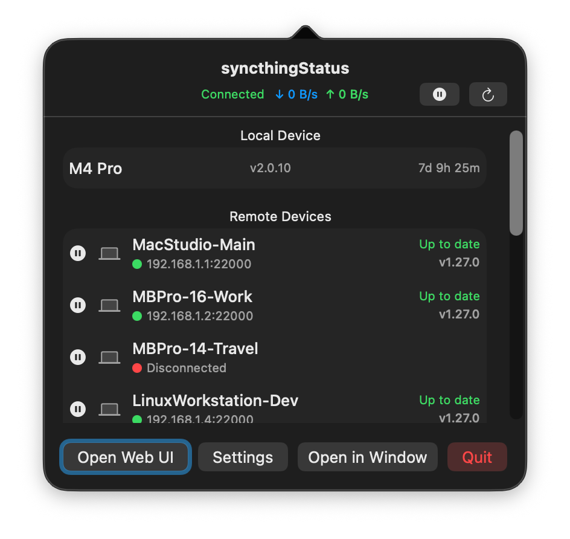 |  | 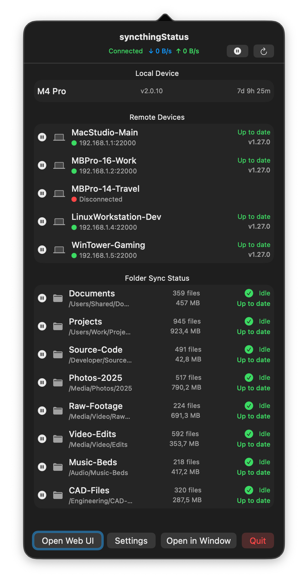 |

### Main Window
Detailed overview with system statistics, expandable device and folder details.

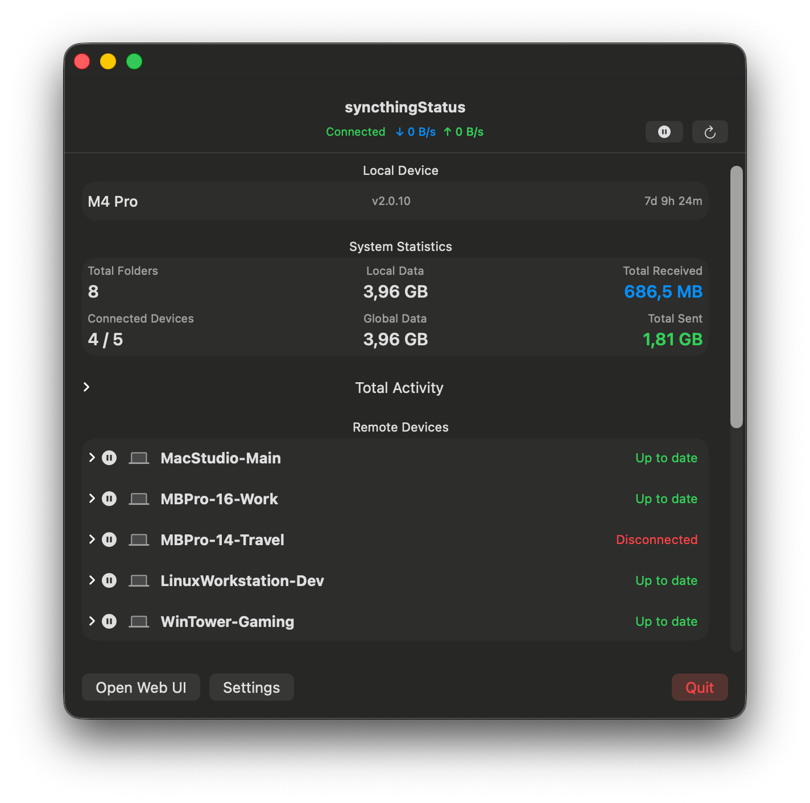

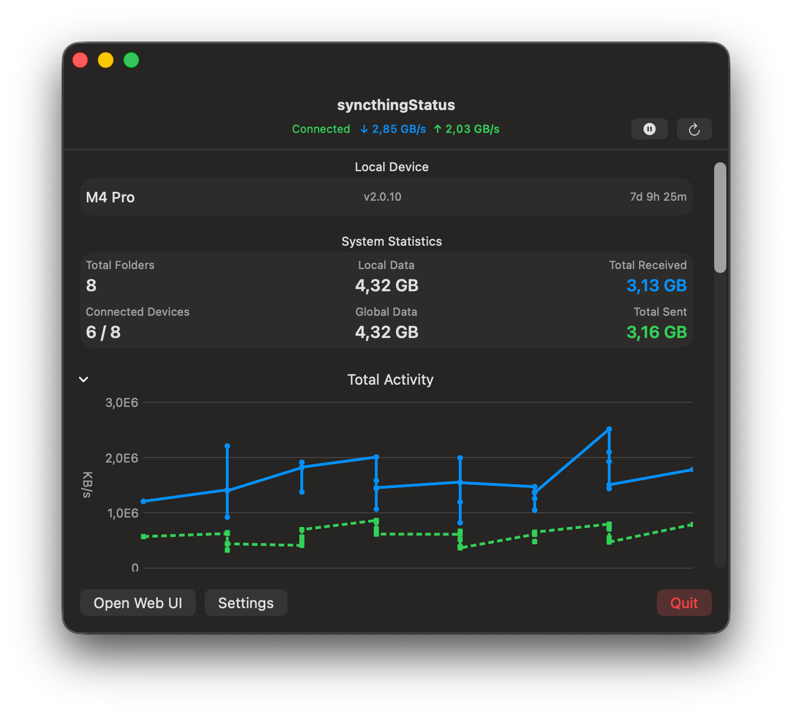

### Detailed Views
Expandable sections showing comprehensive device and folder information.

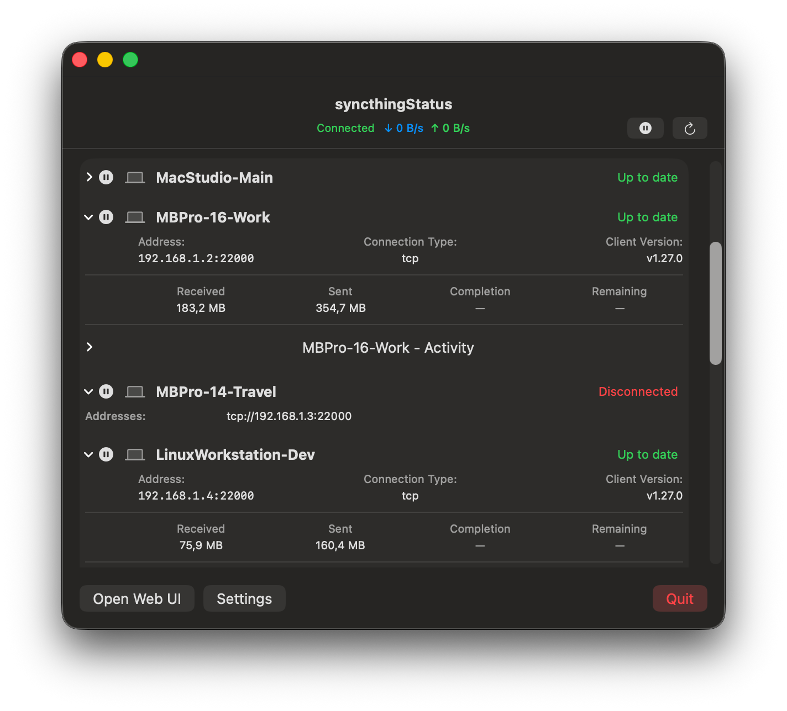

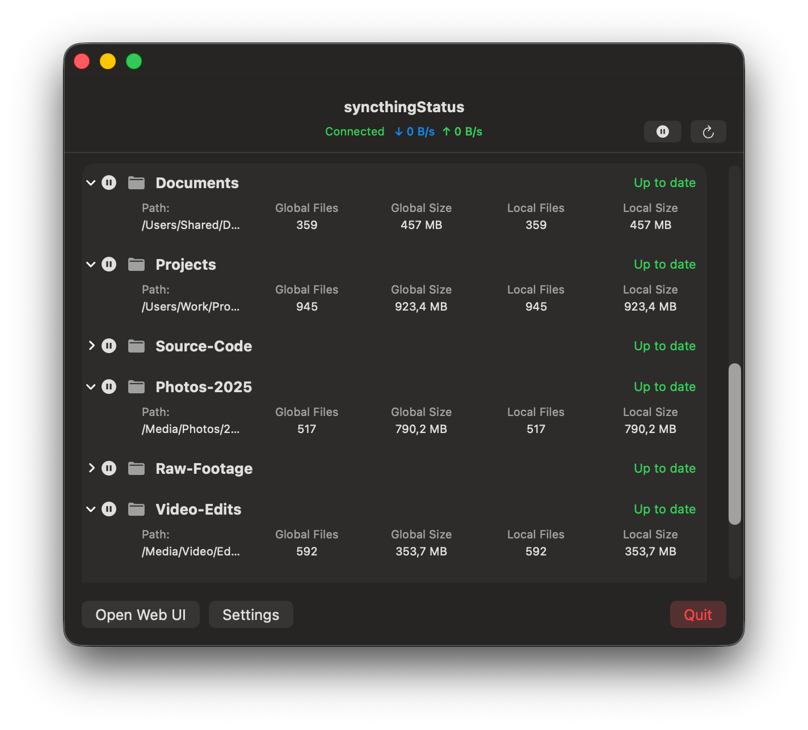

### Settings
Comprehensive configuration options for customizing the app to your needs.

**General & Connection Mode** - Launch at login settings, popover max height control, and connection mode:
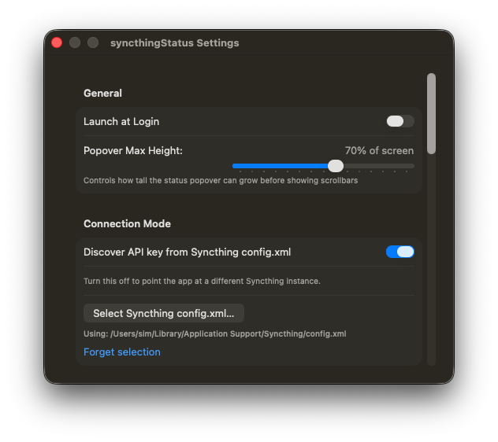

**Manual Configuration & Sync Thresholds** - Manual connection settings and sync completion thresholds:
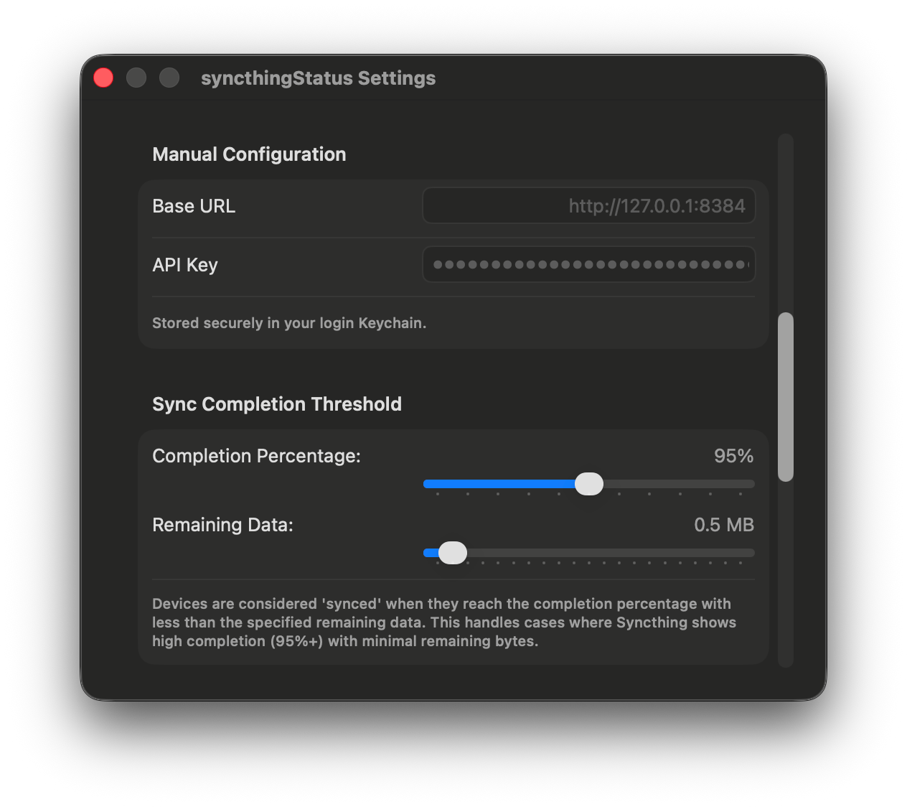

**Monitoring & Notifications** - Refresh interval and notification preferences:
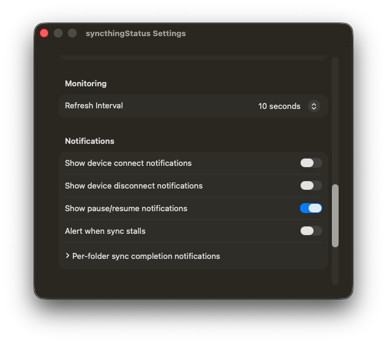

**Updates** - Automatic update checking and manual update controls:
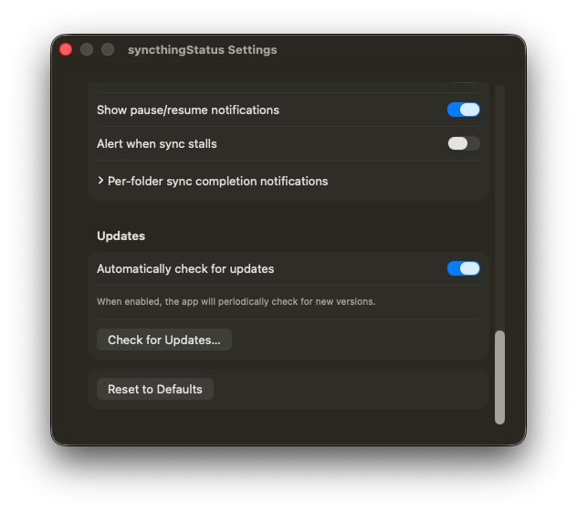

### Demo Mode
Test the app with simulated scenarios without affecting your actual Syncthing setup. Includes quick scenarios like "All Synced", "Syncing", "High-Speed Transfers", and more.

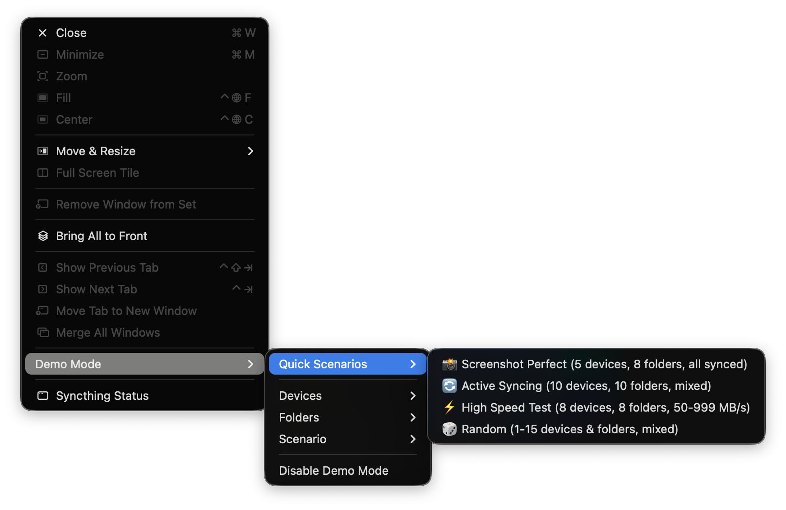

## Download Statistics

View detailed download statistics for each release:

```bash
gh api repos/Xpycode/syncthingStatus/releases --jq '.[] | {version: .tag_name, downloads: ([.assets[].download_count] | add)}'
```

Or visit the [Releases page](https://github.com/Xpycode/syncthingStatus/releases) to see download counts for each version.

## Requirements

- macOS 15.5 or later
- [Syncthing](https://syncthing.net) installed and running
- Xcode 16.4+ (for building from source)

## Installation

### Download Pre-built App
1. Download the latest **[syncthingStatus.dmg](https://github.com/Xpycode/syncthingStatus/releases/latest)** from the Releases page
2. Open the DMG file
3. Drag **syncthingStatus.app** to your Applications folder
4. Launch the app - it will appear in your menu bar

> **Note**: The app is notarized by Apple and will run without security warnings.

> **Auto-update troubleshooting**: if the in-app update fails with _"An error occurred while launching the installer"_, the bundle on disk may be at a malformed path (e.g. `/Applications/syncthingStatus.app.1` or any name without the `.app` suffix — usually a Finder rename mishap). macOS won't dispatch Sparkle's XPC services unless the parent bundle ends in `.app`. Sandboxed builds also need Sparkle's installer launcher service and Mach lookup entitlements; release notarization now asserts both so future packages fail fast instead of shipping a broken updater. Run [`tools/repair-install.sh`](tools/repair-install.sh) for a clean re-install that preserves your settings, or just trash the malformed bundle in `/Applications/` and drag-install fresh from the DMG.

### Build from Source
1. Clone this repository:
   ```bash
   git clone https://github.com/Xpycode/syncthingStatus.git
   cd syncthingStatus
   ```

2. Open `syncthingStatus.xcodeproj` in Xcode

3. Build and run (⌘R)

## Usage

1. **First Launch**: The app will automatically try to discover your Syncthing configuration
2. **Menu Bar Icon**: Click the icon to view current status
3. **Open in Window**: For a more detailed view, click "Open in Window" from the popover
4. **Settings**: Configure connection settings via the Settings button
5. **Web UI**: Quick access to Syncthing's web interface

### Configuration Modes

#### Automatic Discovery (Default)
The app automatically reads your API key from:
- `~/Library/Application Support/Syncthing/config.xml` (standard location)
- `~/.config/syncthing/config.xml` (alternative location)

#### Manual Configuration
To connect to a remote Syncthing instance:
1. Open Settings
2. Disable "Discover API key from Syncthing config.xml"
3. Enter the Base URL (e.g., `http://192.168.1.100:8384`)
4. Enter the API key (found in Syncthing's web UI under Actions → Settings → API Key)

## Technical Details

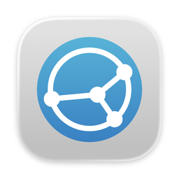

Built with:
- **SwiftUI** for modern, declarative UI
- **Combine** for reactive state management
- **URLSession** for async API calls
- **Keychain Services** for secure credential storage
- **XMLParser** for config file parsing

The app queries the following Syncthing REST API endpoints:
- `/rest/system/status` - System information and uptime
- `/rest/system/config` - Device and folder configuration
- `/rest/system/connections` - Connection status for devices
- `/rest/db/status` - Per-folder synchronization status
- `/rest/db/completion` - Per-device completion percentage
- `/rest/db/need` - Pending items per folder (used to list stuck deletions)
- `/rest/db/scan` - Trigger a folder rescan (inline Rescan + post-cleanup rescan)

## Privacy

- No data collection or telemetry
- All data stays local on your machine
- API keys stored securely in macOS Keychain
- Open source - audit the code yourself

## Contributing

Contributions are welcome! Please feel free to submit a Pull Request.

1. Fork the repository
2. Create your feature branch (`git checkout -b feature/AmazingFeature`)
3. Commit your changes (`git commit -m 'Add some AmazingFeature'`)
4. Push to the branch (`git push origin feature/AmazingFeature`)
5. Open a Pull Request

## Roadmap

Curious about where the app could go next? Check out the evolving ideas in [future-features.md](future-features.md) and feel free to pitch in.

## License

This project is licensed under the MIT License - see the [LICENSE](LICENSE) file for details.

## Acknowledgments

- [Syncthing](https://syncthing.net) - The amazing file synchronization tool this app monitors
- Built with Apple's native frameworks for optimal performance

## Support

If you encounter any issues or have suggestions, please [open an issue](https://github.com/Xpycode/syncthingStatus/issues) on GitHub.

---

Made with ❤️ for the Syncthing community
