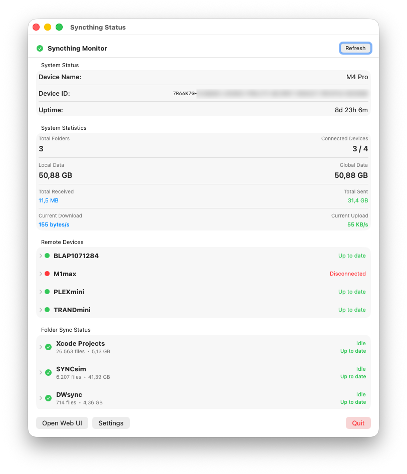
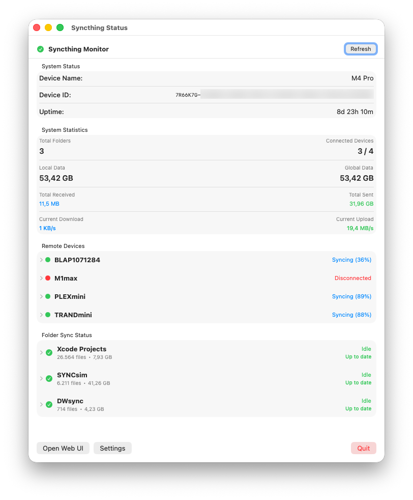

# syncthingStatus

A lightweight macOS menu bar app for monitoring [Syncthing](https://syncthing.net) status in real-time.


[](https://github.com/Xpycode/syncthingStatus/releases/latest)
[](https://github.com/Xpycode/syncthingStatus/releases)

## Features

- **Menu Bar Integration**: Unobtrusive status indicator that lives in your macOS menu bar
- **Real-Time Monitoring**: Automatic updates every 10 seconds
- **Visual Status Indicators**:
  -  **Synced**: When synced to at least one device
  -  **Disconnected**: When Syncthing is unreachable or needs attention
- **Device Monitoring**: Track connection status, sync progress, and transfer rates for all remote devices
- **Folder Status**: View sync state, file counts, and data sizes for each shared folder
- **System Information**: Display device name, uptime, and version information
- **Sync History**: Track recent sync events and folder activity
- **System Statistics**: View total folders, connected devices, data sizes, and current transfer speeds
- **Sync Completion Notifications**: Get macOS notifications when folders finish syncing
- **Configurable Thresholds**: Customize when devices are considered "synced" (percentage and remaining data)
- **Automatic Configuration**: Discovers API key from local Syncthing config.xml
- **Manual Mode**: Connect to remote Syncthing instances with custom URL and API key
- **Secure Credential Storage**: API keys stored in macOS Keychain

## Screenshots

### Popover View
Quick status check from the menu bar - shows device name, sync status, connected devices, and folder information.


### Main Window
Detailed overview with system statistics, device information, folder status, and sync history.





#### Detailed Views
Expand devices and folders to see comprehensive information including connection details, transfer rates, and sync progress.


### Settings
Configure connection, sync thresholds, and notifications.


## Requirements

- macOS 15.5 or later
- [Syncthing](https://syncthing.net) installed and running
- Xcode 16.4+ (for building from source)

## Installation

### Download Pre-built App
1. Download the latest **[syncthingStatus.dmg](https://github.com/Xpycode/syncthingStatus/releases/latest)** from the Releases page
2. Open the DMG file
3. Drag **syncthingStatus.app** to your Applications folder
4. Launch the app - it will appear in your menu bar

> **Note**: The app is notarized by Apple and will run without security warnings.

### Build from Source
1. Clone this repository:
   ```bash
   git clone https://github.com/Xpycode/syncthingStatus.git
   cd syncthingStatus
   ```

2. Open `syncthingStatus.xcodeproj` in Xcode

3. Build and run (⌘R)

## Usage

1. **First Launch**: The app will automatically try to discover your Syncthing configuration
2. **Menu Bar Icon**: Click the icon to view current status
3. **Open in Window**: For a more detailed view, click "Open in Window" from the popover
4. **Settings**: Configure connection settings via the Settings button
5. **Web UI**: Quick access to Syncthing's web interface

### Configuration Modes

#### Automatic Discovery (Default)
The app automatically reads your API key from:
- `~/Library/Application Support/Syncthing/config.xml` (standard location)
- `~/.config/syncthing/config.xml` (alternative location)

#### Manual Configuration
To connect to a remote Syncthing instance:
1. Open Settings
2. Disable "Discover API key from Syncthing config.xml"
3. Enter the Base URL (e.g., `http://192.168.1.100:8384`)
4. Enter the API key (found in Syncthing's web UI under Actions → Settings → API Key)

## Technical Details

Built with:
- **SwiftUI** for modern, declarative UI
- **Combine** for reactive state management
- **URLSession** for async API calls
- **Keychain Services** for secure credential storage
- **XMLParser** for config file parsing

The app queries the following Syncthing REST API endpoints:
- `/rest/system/status` - System information and uptime
- `/rest/system/config` - Device and folder configuration
- `/rest/system/connections` - Connection status for devices
- `/rest/db/status` - Per-folder synchronization status
- `/rest/db/completion` - Per-device completion percentage

## Privacy

- No data collection or telemetry
- All data stays local on your machine
- API keys stored securely in macOS Keychain
- Open source - audit the code yourself

## Contributing

Contributions are welcome! Please feel free to submit a Pull Request.

1. Fork the repository
2. Create your feature branch (`git checkout -b feature/AmazingFeature`)
3. Commit your changes (`git commit -m 'Add some AmazingFeature'`)
4. Push to the branch (`git push origin feature/AmazingFeature`)
5. Open a Pull Request

## Roadmap

Curious about where the app could go next? Check out the evolving ideas in [future-features.md](future-features.md) and feel free to pitch in.

## License

This project is licensed under the MIT License - see the [LICENSE](LICENSE) file for details.

## Acknowledgments

- [Syncthing](https://syncthing.net) - The amazing file synchronization tool this app monitors
- Built with Apple's native frameworks for optimal performance

## Support

If you encounter any issues or have suggestions, please [open an issue](https://github.com/Xpycode/syncthingStatus/issues) on GitHub.

---

Made with ❤️ for the Syncthing community
